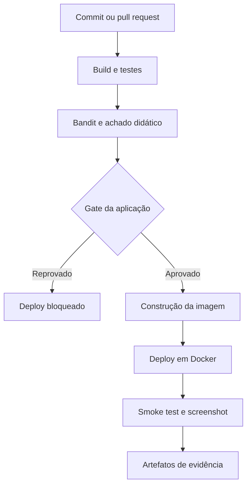

# 🛡️ TechSecure — Secure CI/CD Lab

**AP II de DevSecOps · aplicação em container · segurança automatizada**

Laboratório da empresa fictícia **TechSecure Solutions**. Cada alteração inicia uma esteira que prepara o código, testa a aplicação, identifica um achado didático, aplica um gate de segurança e implanta a versão validada em Docker.

**Estado:** implementação preparada; consulte a execução do GitHub Actions para confirmar build da imagem e deploy. O container do CI existe durante o job e é encerrado ao final. Não há hospedagem pública permanente.

## 🎯 O que este projeto demonstra

| Requisito da atividade | Implementação |
|---|---|
| Código em Git | Este diretório no repositório cybersecurity-labs |
| Pipeline automática | Push e pull request com filtro de caminhos |
| Build | Validação de sintaxe com compileall, adequada a Python |
| Testes | 10 testes unittest, incluindo rejeição de entrada |
| Segurança | Bandit com achado B307 e gate na aplicação |
| Imagem | Dockerfile com usuário sem privilégios |
| Deploy automático | docker run no runner temporário |
| Container e aplicação funcionando | Smoke test HTTP, versão do commit e screenshot |
| Evidências | Artifact com logs, JSONs e print |

## 🧭 Arquitetura



O CI usa runner hospedado pelo GitHub. A imagem contém somente `app/`; o exemplo inseguro não integra a aplicação nem é importado. O deploy recebe o SHA do commit pela variável `APP_VERSION`, permitindo comprovar qual revisão foi implantada.

## 🧰 Tecnologias e escolhas

| Ferramenta | Motivo |
|---|---|
| Python 3.12 e biblioteca padrão | Aplicação pequena, sem dependências de runtime |
| unittest | Testes sem serviço externo |
| Bandit 1.8.6 | Análise estática com achado reproduzível |
| Docker | Empacotamento e execução isolada |
| GitHub Actions | Automação conectada ao versionamento |
| Playwright | Evidência visual automática do container |

O servidor WSGI da biblioteca padrão atende à demonstração acadêmica. Não é uma configuração para produção. O Bandit analisa código Python; este laboratório não afirma cobrir CVEs da imagem, segredos, DAST ou todas as vulnerabilidades possíveis.

## 🔎 Achado e correção

| Campo | Resultado reproduzível |
|---|---|
| Identificador | B307 |
| Componente | security-fixtures/unsafe_calculator.py |
| Problema | eval() recebe uma expressão sem validação |
| Severidade Bandit | MEDIUM |
| Confiança Bandit | HIGH |
| Impacto potencial | Execução de código se entrada não confiável alcançar a função |
| Correção | Parser restrito, conversão para int e soma explícita |

A função insegura existe apenas para análise estática. A aplicação real usa `app/calculator.py`, aceita dois inteiros de até 9 dígitos separados por `+` e rejeita outras expressões. Não execute a amostra insegura.

A etapa didática exige que o scanner retorne **1**, indicando achado, e que o JSON contenha **B307**. Erro do scanner ou ausência do achado reprovam a etapa. O gate da aplicação usa `-ll`, bloqueando achados de severidade média ou alta; achados baixos ficam no JSON, sem bloqueio por essa política.

## 🚀 Comece aqui no Windows

Pré-requisitos: Git, Python 3.12 e Docker Desktop com containers Linux habilitados. Execute no PowerShell:

```powershell
git clone --branch feat/devsecops-ap-ii https://github.com/geovanniandrade/cybersecurity-labs.git
cd cybersecurity-labs\06-devsecops\secure-ci-cd
py -3.12 -m venv .venv
.\.venv\Scripts\python.exe -m pip install -r requirements-dev.txt
.\.venv\Scripts\python.exe -m compileall -q app
.\.venv\Scripts\python.exe -m unittest discover -s tests -v
.\.venv\Scripts\python.exe -m bandit -r app -ll
```

Após a integração na main, clone sem `--branch feat/devsecops-ap-ii`.

### Subir o container local

```powershell
$env:APP_VERSION = (git rev-parse HEAD).Trim()
docker build -t "techsecure:$env:APP_VERSION" .
docker run -d --name techsecure --read-only --tmpfs /tmp:rw,noexec,nosuid,size=16m --cap-drop ALL --security-opt no-new-privileges --memory 128m --cpus 1 -p 127.0.0.1:8080:8080 -e APP_VERSION "techsecure:$env:APP_VERSION"
.\.venv\Scripts\python.exe scripts/smoke.py
Start-Process http://localhost:8080
```

### Consultar evidências e encerrar

```powershell
docker ps --filter name=techsecure
docker logs techsecure
docker inspect techsecure
docker image inspect "techsecure:$env:APP_VERSION"
docker rm -f techsecure
```

Se o nome `techsecure` já estiver ocupado, confirme que se trata do container deste laboratório antes de encerrá-lo. A porta local 8080 também precisa estar livre.

### Executar o scan didático

```powershell
New-Item -ItemType Directory -Force evidence
.\.venv\Scripts\python.exe -m bandit -r security-fixtures -f json -o evidence/bandit-fixture.json
# Exit code 1 é esperado nesta amostra.
.\.venv\Scripts\python.exe scripts/verify_finding.py
```

## 🔁 Demonstração de uma alteração

1. Abra `app/index.html` e altere uma frase visível da página.
2. Na raiz do repositório, faça commit e push na branch do laboratório.
3. Abra **Actions → DevSecOps AP II** e acompanhe a execução.
4. Mostre a sequência de build, testes, Bandit, imagem e deploy.
5. Baixe o artifact `devsecops-evidence-*` e abra `application.png`.
6. Compare a versão no print e no `smoke.json` com a revisão do código. Em pull requests, `github.sha` pode representar o commit de merge de teste.

```powershell
git add 06-devsecops/secure-ci-cd/app/index.html
git commit -m "demo: atualiza mensagem da aplicação"
git push origin feat/devsecops-ap-ii
```

Para comprovar bloqueio do deploy, use uma branch de teste e adicione a função insegura ao código analisado em `app/`, sem integrá-la a uma rota. O gate deverá reprovar e as etapas de imagem e deploy ficarão sem execução. Remova a função, faça novo commit e compare os runs. Não publique uma rota que execute a amostra.

## 📂 Documentação e entrega

- [Guia de execução e evidências](docs/execucao-e-evidencias.md)
- [Relatório técnico para completar com os resultados](docs/relatorio.md)
- [Roteiro de apresentação e vídeo](docs/apresentacao.md)
- [Texto para LinkedIn após validar a execução](docs/linkedin.md)
- [Dockerfile](Dockerfile)
- [Pipeline](../../.github/workflows/devsecops-ap-ii.yml)

**Entrega prevista no enunciado:** 19/10/2026. Antes da submissão, complete integrantes, prints reais, URL da execução e vídeo de 5 a 10 minutos. A apresentação dura 15 minutos e deve incluir todos os integrantes.

## 📚 Referências

- [Bandit e funcionamento da análise estática](https://bandit.readthedocs.io/en/latest/)
- [Regra B307](https://bandit.readthedocs.io/en/latest/blacklists/blacklist_calls.html#b307-eval)
- [Segurança em GitHub Actions](https://docs.github.com/en/actions/reference/security/secure-use)
- [Dockerfile reference](https://docs.docker.com/reference/dockerfile/)

Projeto acadêmico com empresa fictícia e dados de demonstração.
