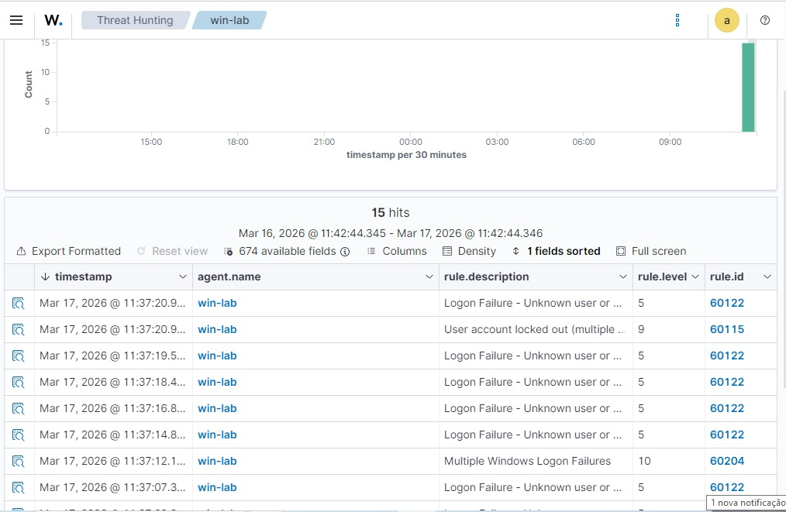

# 🔐 Blue Team Brute Force Detection with Wazuh SIEM

## 📌 Overview

This project demonstrates the detection of a brute force attack in a controlled lab environment using Wazuh SIEM.

The objective was to simulate multiple failed login attempts on a Windows machine and analyze how the SIEM detects and correlates these events.

---

## 🧠 Scenario

The lab environment consists of:

- 🐉 Kali Linux (Attacker - optional)
- 🖥️ Windows Endpoint (Victim + Wazuh Agent)
- 🧠 Wazuh SIEM (Monitoring & Detection)

A brute force attempt was simulated by repeatedly entering incorrect credentials using the `runas` command.

---

## 💣 Attack Simulation

Command used:

```bash
runas /user:vboxuser cmd

## 🔍 Detection Evidence

### Wazuh Dashboard


### Brute Force Detection Events

