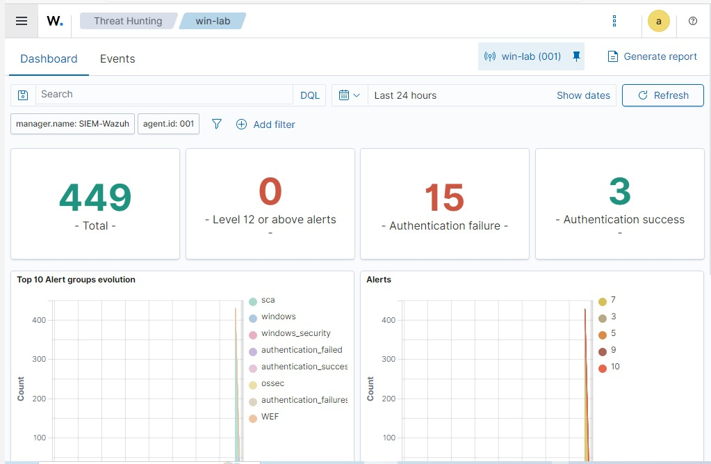
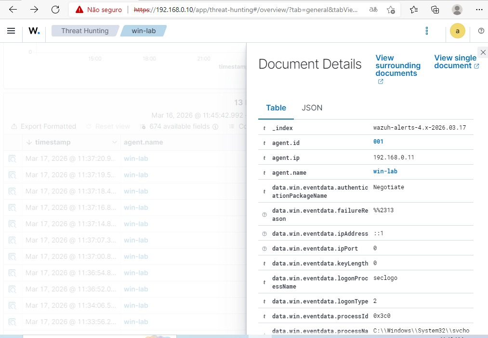
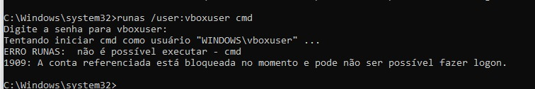

# 🔐 Detecção de Ataque de Força Bruta com Wazuh SIEM

## 📌 Visão Geral

Este projeto demonstra a detecção de um ataque de força bruta em um ambiente de laboratório controlado utilizando o **Wazuh SIEM**.

O objetivo foi simular múltiplas tentativas de login mal-sucedidas em uma máquina Windows e analisar como o SIEM identifica, correlaciona e apresenta esses eventos de segurança.

---

## 🧠 Cenário

O ambiente de laboratório foi composto por:

- 🐉 **Kali Linux** — máquina atacante opcional
- 🖥️ **Windows Endpoint** — vítima com Wazuh Agent instalado
- 🧠 **Wazuh SIEM** — monitoramento, correlação e detecção de eventos

A tentativa de força bruta foi simulada por meio de múltiplas autenticações incorretas utilizando o comando `runas` no Windows.

---

## 💣 Simulação do Ataque

Comando utilizado:

```bash
runas /user:vboxuser cmd
```

Durante a simulação, foram realizadas diversas tentativas de autenticação com senha incorreta, gerando eventos de falha de logon no Windows.

Esses eventos foram coletados pelo **Wazuh Agent** e enviados ao **Wazuh Manager**, permitindo a análise no painel do SIEM.

---

## 🔎 Detecção no Wazuh

O Wazuh identificou eventos relacionados a falhas de autenticação no endpoint Windows, permitindo visualizar:

- Tentativas de login mal-sucedidas
- Eventos de segurança do Windows
- Correlação de múltiplas falhas de autenticação
- Evidências de possível tentativa de força bruta
- Detalhes do evento, usuário, endpoint e regra acionada

---

## 🚨 Indicadores Observados

Durante a análise, foram observados os seguintes indicadores:

- Múltiplas falhas de autenticação em curto período
- Eventos de logon malsucedido no Windows
- Geração de alertas no painel do Wazuh
- Evidência de tentativa de acesso com credenciais inválidas
- Correlação dos eventos pelo SIEM

---

## 📊 Evidências

### 1. Visão Geral do Dashboard do Wazuh


---

### 2. Endpoint Windows com Wazuh Agent



---

### 3. Detecção de Eventos de Força Bruta


---

### 4. Análise Detalhada dos Logs



---

### 5. Evidência de Bloqueio de Conta



---

## ✅ Resultado

O Wazuh conseguiu detectar e apresentar eventos relacionados às tentativas de autenticação malsucedidas no endpoint Windows.

A simulação demonstrou como múltiplas falhas de login podem ser identificadas por meio de logs, regras de correlação e alertas de segurança no SIEM.

Esse tipo de detecção é essencial para identificar possíveis ataques de força bruta, tentativas de acesso não autorizado e comportamentos suspeitos em ambientes corporativos.

---

## 🛡️ Medidas de Mitigação

Para reduzir o risco de ataques de força bruta, recomenda-se:

- Implementar política de bloqueio de conta após múltiplas tentativas inválidas
- Utilizar senhas fortes e complexas
- Aplicar autenticação multifator — MFA
- Monitorar eventos de logon malsucedido
- Criar alertas no SIEM para múltiplas falhas de autenticação
- Revisar contas privilegiadas periodicamente
- Restringir acessos administrativos
- Manter endpoints integrados ao SIEM

---

## 🚀 Competências Demonstradas

- Monitoramento de eventos de segurança
- Análise de logs do Windows
- Detecção de tentativa de força bruta
- Uso do Wazuh SIEM
- Correlação de eventos
- Investigação inicial de incidente
- Mentalidade Blue Team / SOC
- Documentação técnica com evidências

---

## 🧠 Principais Aprendizados

Este laboratório reforça a importância de:

- Monitorar eventos de autenticação em endpoints
- Correlacionar falhas de login para identificar ataques
- Utilizar SIEM para centralizar eventos de segurança
- Implementar controles preventivos contra força bruta
- Analisar evidências antes de concluir um incidente
- Trabalhar com logs como fonte principal de investigação

---

## ⚠️ Aviso Legal

Este projeto foi realizado em um ambiente de laboratório controlado, exclusivamente para fins educacionais e profissionais.

Nenhuma técnica demonstrada deve ser aplicada em ambientes de terceiros sem autorização formal.
