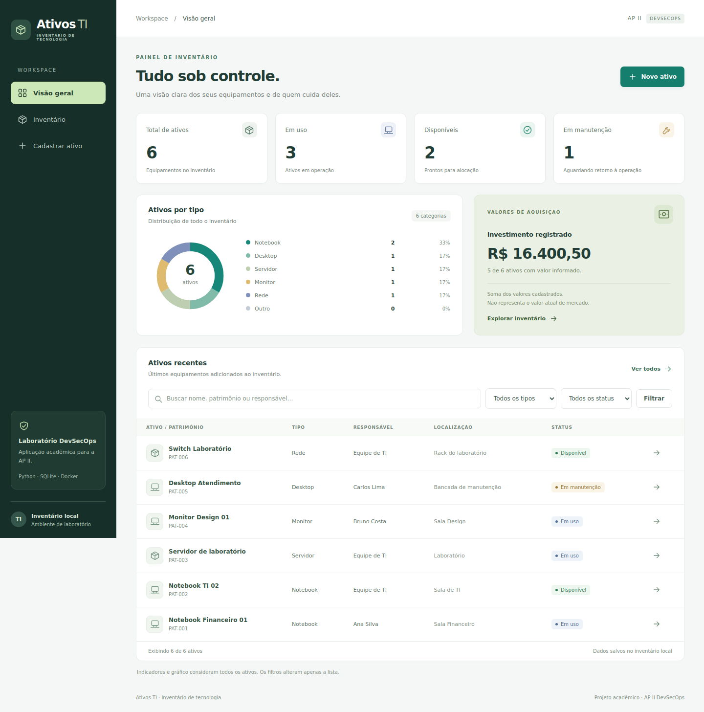

# Ativos TI · Painel de inventário

**Python · Flask · SQLite · Docker | AP II DevSecOps**

> Dashboard executado na VM. Workflow e atualizador implementados; execução remota e ativação do timer ainda precisam de validação.

Aplicação para controlar equipamentos, responsáveis, localização e valores de aquisição. Projeto acadêmico AP II DevSecOps.



## O que esta versão oferece

- Dashboard com total de ativos, disponíveis, em uso e em manutenção.
- Gráfico por tipo, calculado com os registros reais do banco.
- Soma dos valores de aquisição informados e quantidade de ativos com preço preenchido. Valores vazios não são tratados como zero.
- Inventário com busca por nome, patrimônio, responsável, localização, marca/modelo e série; filtros por tipo e status.
- Cadastro, ficha de detalhes, edição e remoção com confirmação.
- Nome, tipo, responsável e status obrigatórios; demais informações opcionais.
- Patrimônio preenchido deve ser único. Preços são armazenados em centavos inteiros, evitando erros de ponto flutuante.
- Interface responsiva em português, sem CDN, JavaScript ou serviços externos.

**Os indicadores sempre consideram o inventário inteiro; os filtros alteram somente a lista.** A visão geral exibe os oito últimos registros quando não há filtros. A página Inventário exibe todos os resultados.

## Arquivos e função

| Arquivo/pasta | Função |
| --- | --- |
| `app.py` | Rotas, validações, acesso ao banco, migração e cálculo do dashboard |
| `templates/` | Dashboard, cadastro, detalhes, edição, confirmação de remoção e erros |
| `static/style.css` | Layout e adaptação para telas pequenas |
| `tests/test_app.py` | Testes de comportamento, migração, valores e entradas |
| `Dockerfile` | Imagem Python + Flask + Gunicorn com usuário sem privilégios |
| `compose.yaml` | Container local, porta 8080, volume persistente e reinício |

## Documentação

- [Arquitetura e persistência](docs/arquitetura.md)
- [Pipeline e deploy automático](docs/pipeline.md)
- [Controles e análise de segurança](docs/seguranca.md)
- [Validação realizada](docs/validacao.md)
- [Prévias desktop, ficha e celular](docs/preview/)

## Obter o código

```bash
git clone --branch feat/cadastro-ativos https://github.com/geovanniandrade/cybersecurity-labs.git
cd cybersecurity-labs/devsecops/cadastro-ativos
```

## Executar localmente

Python 3.12, no Linux:

```bash
python3 -m venv .venv
source .venv/bin/activate
pip install -r requirements.txt
python -m unittest discover -s tests -v
flask --app 'app:create_app()' run --port 8080
```

Abra http://127.0.0.1:8080. Flask CLI é para desenvolvimento; o container usa Gunicorn.

## Docker

```bash
docker compose up -d --build
docker compose ps
```

Na VM o acesso fica em `127.0.0.1:8080`. Para acessar pelo Windows, execute em outra janela do PowerShell e mantenha-a aberta:

```powershell
ssh -N -L 8080:127.0.0.1:8080 docker01@127.0.0.1 -p 2200
```

Abra http://127.0.0.1:8080 no Windows. O Juice Shop permanece separado na porta 3000.

## Atualizar a versão inicial preservando os registros

A migração da versão inicial foi testada com um banco temporário. Antes de atualizar a VM, faça backup e mantenha o mesmo nome de projeto e volume.

1. Obtenha o código desta branch. Para a primeira atualização da VM, você também pode usar o pacote `Cadastro_Ativos_Dashboard_v2.zip` com a pasta `cadastro-ativos` preparada para transferência via SCP.
2. Na VM, faça uma cópia do banco antes de iniciar a nova versão:

```bash
cd /home/docker01/cadastro-ativos
mkdir -p backups
docker compose exec -T web python -c "import os, sqlite3; source=sqlite3.connect(os.environ['DATABASE_PATH']); target=sqlite3.connect('/tmp/ativos-backup.sqlite3'); source.backup(target); target.close(); source.close()"
docker compose cp web:/tmp/ativos-backup.sqlite3 "backups/ativos-$(date +%Y%m%d-%H%M%S).sqlite3"
```

A API de backup do SQLite produz uma cópia consistente mesmo com o banco aberto. Se um comando falhar, resolva antes de prosseguir.

3. Extraia o novo pacote sobre a mesma pasta:

```bash
cd /home/docker01
python3 -m zipfile -e Cadastro_Ativos_Dashboard_v2.zip .
cd cadastro-ativos
docker compose up -d --build
docker compose ps
```

O projeto Compose continua chamado `cadastro-ativos`, com o volume `cadastro-ativos_ativos_data`. A migração adiciona colunas sem apagar registros, alterar IDs ou datas. Os ativos antigos recebem status inicial **Disponível**; revise seu status pela edição. Campos extras ficam vazios e o valor fica não informado.

Atualize o navegador antes de salvar um formulário. A chave de sessão é gerada ao iniciar se `APP_SECRET` não estiver definida, então formulários anteriores à reinicialização expiram.

**Não use `docker compose down -v`: a opção remove o volume e o banco.** O banco, backups e dados de teste não devem ser publicados no Git nem entrar na imagem.

## Remoção

Abrir a tela de remoção não exclui nada. A exclusão exige marcar a confirmação e enviar o formulário protegido por CSRF. A operação exclui definitivamente apenas o registro escolhido; a aplicação não tem lixeira.

## Validação e pendências

11 testes automatizados passaram, incluindo uma migração a partir do esquema da versão inicial. Cadastro, edição, busca e remoção também foram verificados no navegador Chromium em uma aplicação servida por Gunicorn; layout inspecionado em desktop e celular. Os testes usam bancos temporários. Os dados de demonstração usados na prévia não são inseridos automaticamente.

O usuário confirmou o dashboard atualizado na VM após o build Docker manual. A aplicação destina-se ao laboratório local, sem autenticação. O workflow CI/CD e os arquivos do deploy automático estão implementados; a execução no Actions e a ativação do timer ainda precisam de validação. Relatório, achado real de segurança e evidências finais continuam pendentes.

## Referências

- [SQLite com Flask](https://flask.palletsprojects.com/en/stable/tutorial/database/)
- [Gunicorn com Flask](https://flask.palletsprojects.com/en/stable/deploying/gunicorn/)
- [Backup SQLite em Python](https://docs.python.org/3/library/sqlite3.html#sqlite3.Connection.backup)
