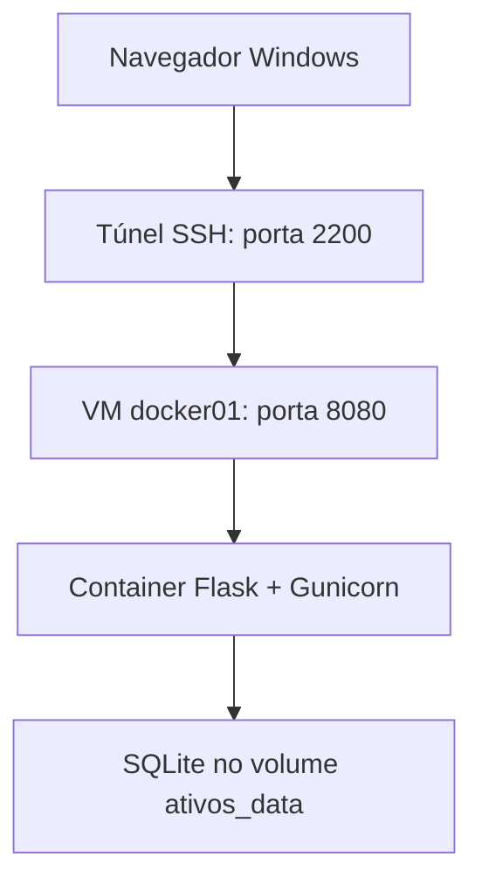

# Arquitetura

O navegador Windows acessa a porta 8080 da VM pelo túnel SSH na porta 2200. O Docker publica a aplicação apenas no endereço local da VM.

| Componente | Responsabilidade |
| --- | --- |
| Flask | Rotas, validação, formulários, métricas e gráficos SVG |
| Gunicorn | Servir a aplicação; um processo com quatro threads |
| SQLite | Registros e valores de aquisição em centavos |
| Volume `cadastro-ativos_ativos_data` | Preservar o banco quando o container é recriado |
| SSH | Acesso do Windows à VM sem expor o serviço publicamente |

O arquivo do banco é `/app/data/ativos.sqlite3` dentro do container. Ele não acompanha o código Git nem a imagem. A atualização adiciona novas colunas ao esquema inicial sem apagar os registros. O status inicial dos registros migrados é Disponível; responsável, ID e data originais permanecem, e os campos adicionais podem ser preenchidos pela edição.

A aplicação não usa o Juice Shop, que é independente na porta 3000. O volume não substitui um backup. A remoção na aplicação exclui permanentemente apenas o ativo confirmado.
