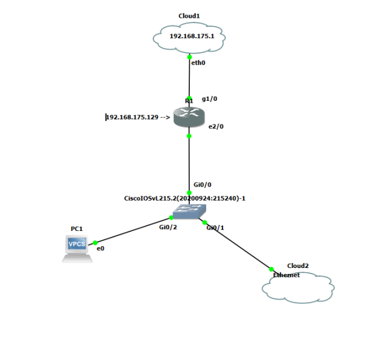
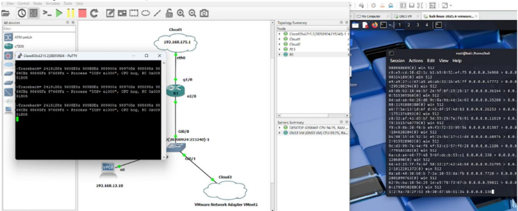
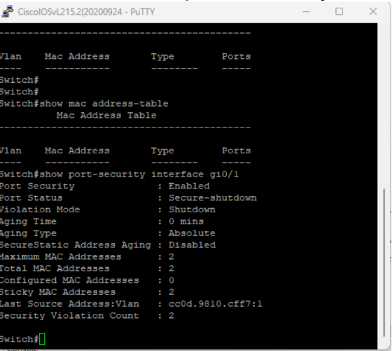

# 🟣 MAC Flooding Attack & Mitigation (Port Security)
## 🧠 Scenario

During normal network operations, users began reporting intermittent connectivity issues and unusual network instability.

Initial symptoms included:
- Loss of connectivity to internal systems
- High latency
- Inconsistent access to network resources

The issue suggested a potential Layer 2 network attack or misconfiguration.

### Network topology

## 🚨 Detection

The abnormal behavior was identified through:

- Sudden degradation in network performance
- Switch behaving like a hub (broadcasting traffic)
- MAC address table instability

Indicators of compromise (IoCs):
- Excessive MAC address entries
- Rapid MAC table changes
- Flood of unknown source MAC addresses

- ## 🔍 Investigation

A controlled lab environment was used to reproduce the issue.

### Attack Simulation:
- Tool used: macof (Kali Linux)
- Objective: Flood the switch CAM table with fake MAC addresses

Command used:
macof -i eth0

### Observed Behavior:
- Switch CAM table overflowed
- Legitimate MAC addresses were dropped
- Switch started broadcasting traffic to all ports

- ## 💥 Impact

The attack caused:

- Network instability
- Loss of segmentation
- Increased risk of traffic sniffing
- Potential data exposure

In a real environment, this could lead to:
- Credential interception
- Lateral movement
- Internal network compromise

- ## 🛡️ Mitigation

To contain the attack, Port Security was implemented on the switch.

### Configuration Applied:
- Limit MAC addresses per port
- Define violation mode (shutdown / restrict)
- Bind MAC addresses to specific ports

Example:
switchport port-security
switchport port-security maximum 2
switchport port-security violation shutdown

## ✅ Outcome

After applying security controls:

- MAC flooding attack was mitigated
- CAM table remained stable
- Network performance normalized
- Unauthorized devices were blocked

- ## 📚 Lessons Learned

- Layer 2 attacks can disrupt entire networks
- Lack of port security exposes infrastructure
- Monitoring network behavior is critical
- Preventive controls are essential in enterprise environments

- ## 🧰 Technologies

- Kali Linux
- macof (dsniff)
- GNS3
- Layer 2 Switch

## 📸 Evidence

### Attack in progress

### Port Security triggered

