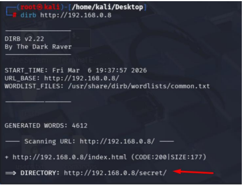
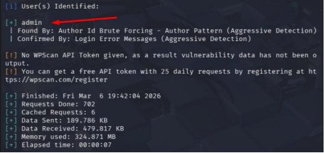

# Laboratório de Pentest em WordPress

## 🎯 Objetivo

Realizar um teste de intrusão em uma aplicação WordPress vulnerável, dentro de um ambiente de laboratório controlado.

## Etapas Realizadas

1. Varredura de rede utilizando Nmap
2. Enumeração de tecnologias utilizando WhatWeb
3. Enumeração do WordPress utilizando WPScan
4. Descoberta de usuários
5. Ataque de força bruta utilizando uma wordlist de senhas
6. Acesso administrativo ao painel do WordPress

## 🛠️ Ferramentas Utilizadas

- Nmap
- WhatWeb
- WPScan
- Kali Linux

## Principais Descobertas

- Servidor web Apache identificado
- Versão do WordPress 4.9 identificada
- Usuário válido descoberto: **admin**
- Senha fraca identificada por meio de força bruta

## ✅ Resultado

Foi possível autenticar com sucesso no painel administrativo do WordPress.

Este laboratório demonstra como credenciais fracas podem levar ao comprometimento completo de uma aplicação web.

## 📚 Aprendizados

Este laboratório reforça a importância de:

- Políticas de senhas fortes
- Atualização contínua do WordPress, plugins e temas
- Monitoramento de tentativas de autenticação
- Restrição de acesso ao painel administrativo
- Uso de autenticação multifator, quando possível

## Evidências

### Varredura com Nmap

### Enumeração de Diretórios

### Identificação de Tecnologias

### Enumeração de Usuários

### Ataque de Força Bruta

### Acesso Administrativo ao WordPress

